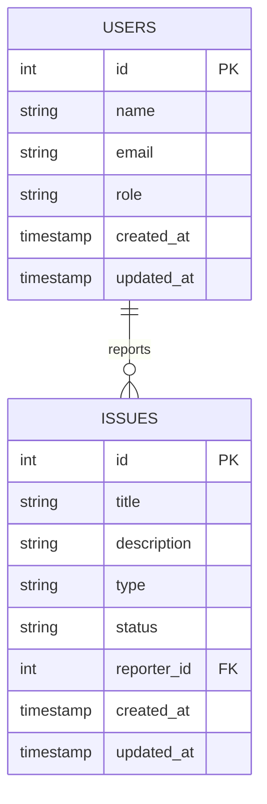

# devpulse

### A collaborative platform for software teams to report bugs, suggest features, and coordinate resolutions.

## Basics:

- In this backend project, a user can register himself/herself as either a **contributor** or a **maintainer**. Contributors can create new issues (reporting bugs or feature requests), while maintainers can access system mechanics, update the status of any existing issue (open, in-progress, resolved), and delete existing issues.
  - Once a new user is registered, the system sends a 201 (created) message, reflecting a successful post.
  - Once a user provides correct email and password, the system sends a 200 (okay) message, reflecting a successful login.

## Live Link: (https://devpulse-one-ruby.vercel.app/)

## API EndPoints:

- Users:
  - **register:** POST /api/auth/signup

  - **login:** POST /api/auth/login

- Issues:
  - **create a new issue:** POST `/api/issues` - (`headers.authentication` must have a valid JWT token)
  - **get all the issues:** GET `/api/issues`
    - options: `sort`, `search` by `type` or `status`
  - **get one issue:** GET `/api/issues/:id`

  - **update an issue:** PATCH `/api/issues/:id`
    - must have a valid JWT Token stored in headers.authentication
    - `maintainer` can update any existing issue irrespective of their status and reporter
    - `contributor` can only update the issues posted by them, as long as the issues are `open`

  - **delete an issue:** DELETE /api/issues/:id
    - must have a valid JWT Token stored in headers.authentication
    - only `maintainer`s can delete any issue

## Database Schema:

